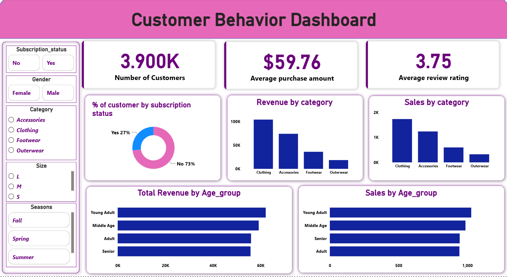

# Customer Shopping Behavior Analysis & Dashboard

An end-to-end data analytics project analyzing customer purchasing behavior, product performance, demographics, discounts, and subscription patterns.

The project follows a practical analytics workflow: **data cleaning with Python and Pandas → MySQL database integration → SQL business analysis → Power BI dashboard → Gamma presentation**.

The objective is to transform raw customer shopping data into meaningful business insights and present those insights through interactive visualizations and a professional presentation.

---

## 🛠️ Tech Stack & Tools

* **Python** — Data cleaning and preprocessing
* **Pandas** — Data manipulation and transformation
* **Jupyter Notebook** — Data cleaning and analysis
* **MySQL** — Relational database and data storage
* **SQL** — Business analysis and querying
* **Power BI** — Interactive dashboard development
* **Gamma** — Presentation and data storytelling
* **Git & GitHub** — Version control and project documentation

---

## 📌 Project Workflow

```text
┌──────────────────────────┐
│     Raw Customer Data    │
│       3,900 Records      │
└────────────┬─────────────┘
             │
             ▼
┌──────────────────────────┐
│ Python Data Cleaning     │
│ Pandas + Jupyter         │
└────────────┬─────────────┘
             │
             ▼
┌──────────────────────────┐
│ MySQL Database           │
│ Customer Table           │
└────────────┬─────────────┘
             │
             ▼
┌──────────────────────────┐
│ SQL Business Analysis    │
│ Aggregations + CTEs      │
│ Window Functions         │
└────────────┬─────────────┘
             │
             ▼
┌──────────────────────────┐
│ Power BI Dashboard       │
│ KPIs + Interactive Views │
└────────────┬─────────────┘
             │
             ▼
┌──────────────────────────┐
│ Gamma Presentation       │
│ Insights + Findings      │
└──────────────────────────┘
```

---

## 1. Data Cleaning & Preprocessing

The raw customer shopping dataset contains **3,900 customer records**.

Data preparation was performed using Python and Pandas in Jupyter Notebook.

### Key steps

* Loaded and inspected the raw dataset.
* Checked column names, data types, and data quality.
* Identified missing values.
* Handled missing `review_rating` values using category-specific median imputation.
* Standardized column names.
* Created meaningful customer age groups.
* Prepared the cleaned dataset for database analysis.
* Loaded the cleaned data into MySQL.

---

## 2. MySQL Database Integration

After cleaning the dataset in Python, the data was loaded into a MySQL database.

The database contains a `customer` table that was used for SQL-based business analysis.

The Python-to-MySQL workflow provided practical experience with:

* Database creation
* Table creation
* Data insertion
* Python–MySQL connection
* SQL querying
* Relational data analysis

---

## 3. SQL Business Analysis

SQL was used to investigate customer behavior and answer practical business questions.

### SQL techniques used

* `SELECT`
* `WHERE`
* `GROUP BY`
* `ORDER BY`
* `HAVING`
* `SUM()`
* `AVG()`
* `COUNT()`
* `MIN()`
* `MAX()`
* Subqueries
* `CASE`
* Common Table Expressions (CTEs)
* Window functions
* `ROW_NUMBER()`
* `RANK()`
* `LAG()`
* `LEAD()`

The analysis focused on revenue, customer behavior, product performance, discounts, subscriptions, and demographic patterns.

---

# 📊 Key Business Questions & Analysis

## 1. Revenue by Gender

### Business Question

**What is the total revenue generated by male and female customers?**

```sql
SELECT 
    gender,
    SUM(purchased_amount) AS total_revenue
FROM customer
GROUP BY gender;
```

### Result

* Male customers: **$157,890**
* Female customers: **$75,191**

This analysis provides a basic breakdown of revenue contribution by gender.

---

## 2. Subscriber vs. Non-Subscriber Analysis

### Business Question

**How do subscribers and non-subscribers compare in terms of customers, average spending, and total revenue?**

```sql
SELECT 
    subscription_status,
    COUNT(customer_id) AS total_customers,
    ROUND(AVG(purchased_amount), 2) AS avg_spend,
    ROUND(SUM(purchased_amount), 2) AS total_revenue
FROM customer
GROUP BY subscription_status
ORDER BY total_revenue DESC;
```

### Results

| Subscription Status | Customers | Average Spend |
| ------------------- | --------: | ------------: |
| Subscriber          |     1,053 |        $59.49 |
| Non-Subscriber      |     2,847 |        $59.87 |

This comparison shows that the two groups have very similar average transaction values in this dataset.

---

## 3. Customer Segmentation

Customers were classified into segments based on previous purchases.

| Segment   | Definition                      | Customers |
| --------- | ------------------------------- | --------: |
| New       | 1 previous purchase             |        83 |
| Returning | 2–10 previous purchases         |       701 |
| Loyal     | More than 10 previous purchases |     3,116 |

### SQL

```sql
WITH customer_type AS (
    SELECT 
        customer_id,
        previous_purchases,
        CASE 
            WHEN previous_purchases = 1 THEN 'New'
            WHEN previous_purchases BETWEEN 2 AND 10 THEN 'Returning'
            ELSE 'Loyal'
        END AS customer_segment
    FROM customer
)
SELECT 
    customer_segment,
    COUNT(*) AS number_of_customers
FROM customer_type
GROUP BY customer_segment;
```

This segmentation helps identify differences in customer purchasing frequency.

---

## 4. Top Items by Category

Window functions were used to rank products within each category.

### Top-performing items identified

**Accessories**

* Jewelry — 171 orders
* Sunglasses — 161 orders
* Belt — 161 orders

**Clothing**

* Blouse — 171 orders
* Pants — 171 orders
* Shirt — 169 orders

**Footwear**

* Sandals — 160 orders
* Shoes — 150 orders
* Sneakers — 145 orders

**Outerwear**

* Jacket — 163 orders
* Coat — 161 orders

This analysis demonstrates the use of SQL window functions for category-level product ranking.

---

# 📈 Power BI Dashboard

The SQL analysis was transformed into an interactive Power BI dashboard.

### Dashboard KPIs

* **Total Customers:** 3.90K
* **Average Purchase Amount:** $59.76
* **Average Review Rating:** 3.75

### Dashboard Analysis

The dashboard provides views of:

* Customer purchasing behavior
* Revenue performance
* Product categories
* Customer demographics
* Subscription status
* Shopping patterns

The dashboard allows users to interact with the data and explore different aspects of customer behavior.

### Dashboard Preview

Add your Power BI screenshot here:

```markdown

```

---

# 📊 Key Findings

Based on the analysis:

* Male customers generated higher total revenue than female customers in the dataset.
* Subscribers and non-subscribers had very similar average purchase amounts.
* The dataset contains a substantially larger number of customers classified as loyal based on previous purchase count.
* Clothing, Accessories, Footwear, and Outerwear were analyzed for product-level performance.
* Window functions were used to identify top products within each category.
* Customer demographics and purchasing behavior were analyzed through SQL and Power BI.

---

# 📑 Project Presentation

A presentation was created using **Gamma** to communicate:

* Project objective
* Data preparation process
* SQL analysis
* Business questions
* Key findings
* Power BI dashboard
* Business insights

The presentation is included in the repository as a PDF.

---

# 📂 Repository Files

All project files are stored directly in the repository root.

```text
Customer-Shopping-Behavior/
│
├── customer_shopping_behavior.csv
├── customer-shopping-behaviour-analysis.ipynb
├── CustomerShoppingBehaviour.sql
├── customer_shopping_behavior.pbix
├── Customer Shopping Behavior Analysis Reports.pdf
└── README.md
```

### File Description

| File                                                | Description                                                        |
| ----------------------------------------------------| ------------------------------------------------------------------ |
| `customer_shopping_behavior.csv`                    | Raw customer shopping dataset                                      |
| `customer-shopping-behaviour-analysis.ipynb`        | Python/Jupyter Notebook containing data cleaning and preprocessing |
| `CustomerShoppingBehaviour.sql`                     | SQL queries used for business analysis                             |
| `customer_shopping_behavior.pbix`                   | Power BI dashboard                                                 |
| `Customer Shopping Behavior Analysis Reports.pdf`   | Gamma-generated project presentation                               |
| `README.md`                                         | Project documentation                                              |

# 💡 Skills Demonstrated

* Python
* Pandas
* Data Cleaning
* Data Preprocessing
* Jupyter Notebook
* MySQL
* SQL
* Aggregate Functions
* Subqueries
* CTEs
* Window Functions
* Business Question Formulation
* Power BI
* Data Visualization
* Dashboard Development
* Data Storytelling
* Git & GitHub

---

# 🚀 Project Outcome

This project demonstrates an end-to-end data analytics workflow, from preparing raw customer data to communicating business insights through SQL, Power BI, and a presentation.

It demonstrates practical experience in:

**Raw Data → Python/Pandas → MySQL → SQL Analysis → Power BI → Business Insights**

---

## 👨‍💻 Author

**Muhammad Sohaib**

Computer Science Graduate | Aspiring Data Analyst | Data Science Enthusiast

* **GitHub:** [MuhammadSohaib143-hs](https://github.com/MuhammadSohaib143-hs)
* **LinkedIn:** [Muhammad Sohaib](https://www.linkedin.com/in/muhammad-sohaib-9b11a9340/)

---

⭐ If you find this project useful, consider giving the repository a star.
